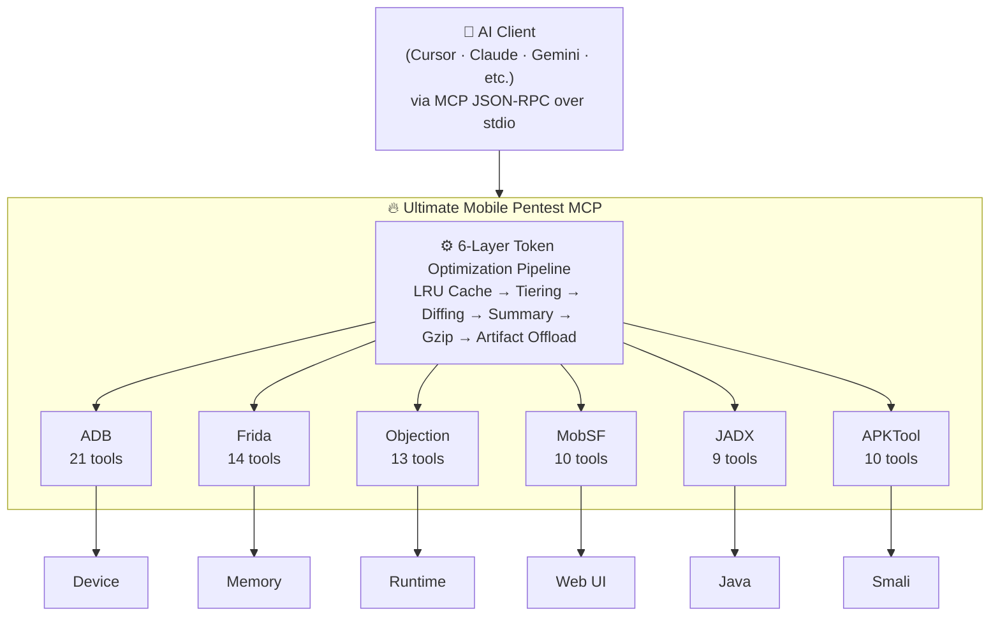

<div align="center">

# 🔥 Ultimate Mobile Pentest MCP

### v2.0.0

[](https://modelcontextprotocol.io)
[](LICENSE)
[](https://github.com/Wael-Rd/ultimate-mobile-mcp)
[](https://github.com/Wael-Rd/ultimate-mobile-mcp)
[](https://github.com/Wael-Rd/ultimate-mobile-mcp)
[](https://github.com/Wael-Rd/ultimate-mobile-mcp/stargazers)

**The first unified MCP server that bridges the entire mobile application security arsenal into a single, AI-orchestrated endpoint.**

*Give your AI agent a scalpel. Give it a sledgehammer. Give it both.*

> Claude · Gemini · Cursor · Windsurf · Any MCP-Compatible AI Client
>
> **DECOMPILE · PATCH · REPACK · BYPASS · INSTRUMENT · OWN**

</div>

---

## ⚡ Architecture



---

## 🧠 The Context Window Problem — Annihilated

> A single decompiler listing can generate **100KB+ of output** — that's **30,000+ tokens** gone in one command. Three commands and your context is dead.

### 🛡️ The 6-Layer Defense

| # | Layer | What It Does | Tokens Saved |
|:-:|:------|:-------------|:------------:|
| **1** |  **LRU Cache** | Identical calls return instantly — zero execution, zero tokens | **100%** on repeats |
| **2** |  **Tiered Delivery** | `minimal` · `summary` · `full` — AI picks what it needs | **60 – 80%** |
| **3** |  **Smart Diffing** | Sends only *what changed* between repeated polling calls | **85 – 95%** |
| **4** |  **Summary Extraction** | RegExp matchers strip boilerplate, surface only critical findings | **50 – 70%** |
| **5** |  **Gzip Compression** | Artifacts stored compressed, preserving local disk | **70%** size cut |
| **6** |  **Artifact Offloading** | Dumps >500 lines saved as `.md` — AI gets path + summary only | **95%+** |

```
Before:  ████████████████████████████████████  100,000 tokens
After:   ████                                   11,600 tokens  (88.4% saved)
```

---

## 🛠️ Arsenal — 83 Tools, 6 Engines

<details>
<summary><b> ADB Engine — 21 Tools</b></summary>
<br/>

| Category | Tools |
|:---------|:------|
| **Device Management** | `adb_devices` · `adb_getprop` · `adb_port_forward` |
| **Application Operations** | `adb_install` · `adb_uninstall` · `adb_clear_data` · `adb_list_packages` |
| **Security Inspection** | `adb_dump_package` · `adb_list_permissions` *(auto-flags dangerous)* · `adb_list_activities` · `adb_check_debuggable` |
| **Shell & Filesystem** | `adb_shell` · `adb_pull` · `adb_push` |
| **Debug & Monitor** | `adb_logcat` *(noise-filtered)* · `adb_screenshot` · `adb_backup` |
| **Intent Manipulation** | `adb_start_activity` · `adb_start_service` · `adb_broadcast` |

</details>

<details>
<summary><b> Frida Instrumentation — 14 Tools</b></summary>
<br/>

| Category | Tools |
|:---------|:------|
| **Session Management** | `frida_ps` · `frida_ps_apps` · `frida_spawn` · `frida_attach` · `frida_kill` |
| **Scripting & Evaluation** | `frida_eval` *(arbitrary JS into process memory)* · `frida_trace` *(native method tracer)* · `frida_enum_classes` |
| **⭐ Bypass & Hook Injectors** | `frida_hook_ssl_pinning` *(universal SSL bypass)* · `frida_hook_root_detection` · `frida_hook_crypto` *(live AES/DES/RSA key extraction)* · `frida_hook_intent` · `frida_hook_shared_prefs` · `frida_dump_ui` |

</details>

<details>
<summary><b> Objection Runtime — 13 Tools</b></summary>
<br/>

| Category | Tools |
|:---------|:------|
| **Inspection** | `objection_explore` · `objection_env` · `objection_clipboard` |
| **Bypass** | `objection_sslpinning_disable` |
| **File System & Data** | `objection_ls` · `objection_cat` · `objection_download` · `objection_sqlite_dump` *(auto-extracts all SQLite tables)* · `objection_dump_keys` *(full keystore dump)* |
| **Android / iOS Specifics** | `objection_list_activities` · `objection_list_services` · `objection_list_receivers` · `objection_search_classes` · `objection_list_class_methods` · `objection_plist_read` |

</details>

<details>
<summary><b> MobSF Cloud Client — 10 Tools</b></summary>
<br/>

| Category | Tools |
|:---------|:------|
| **Core** | `mobsf_upload` · `mobsf_scan` · `mobsf_delete_scan` · `mobsf_recent_scans` |
| **Reports** | `mobsf_report_json` *(machine-readable static analysis)* · `mobsf_pdf_report` *(visual PDF dossier)* |
| **Dynamic** | `mobsf_dynamic_start` · `mobsf_dynamic_stop` · `mobsf_frida_logs` · `mobsf_api_info` |

</details>

<details>
<summary><b> JADX Decompiler — 9 Tools</b></summary>
<br/>

| Category | Tools |
|:---------|:------|
| **Decompile Core** | `jadx_decompile` · `jadx_decompile_resources` · `jadx_read_source` |
| **⭐ Automated Security Audits** | `jadx_search_secrets` *(hardcoded API keys, Firebase URLs)* · `jadx_search_crypto` *(MD5/SHA-1/ECB insecure usage)* · `jadx_search_urls` *(endpoints, domains, IPs from bytecode)* · `jadx_search_permissions` *(dangerous permission call sites)* |
| **Navigation** | `jadx_list_classes` · `jadx_show_structure` |

</details>

<details>
<summary><b> APKTool Engine — 10 Tools</b></summary>
<br/>

| Category | Tools |
|:---------|:------|
| **Core** | `apktool_decode` *(smali + raw resource disassembly)* · `apktool_build` *(rebuilds folder back into binary APK)* |
| **Inspection** | `apktool_read_manifest` · `apktool_list_resources` · `apktool_read_resource` |
| **⭐ Surgical Patch Suite** | `apktool_patch_manifest` *(debuggable / perms / visibility)* · `apktool_read_smali` · `apktool_patch_smali` *(opcode injection)* · `apktool_search_smali` *(regex search across all smali)* · `apktool_patch_and_rebuild` *(decode ▶ patch ▶ build ▶ sign)* |

</details>

<details>
<summary><b> Meta & Workflow — 6 Tools</b></summary>
<br/>

| Tool | Description |
|:-----|:------------|
| `pentest_workflow` | Full static pipeline in a single command |
| `check_tools` | Dependency health check |
| `token_stats` | Live optimization dashboard |
| `read_artifact` | Read offloaded file payloads |

</details>

---

##  Installation

### Step 1 — Prerequisites

<details>
<summary><b>🐧 Ubuntu / Kali / WSL</b></summary>

```bash
sudo apt install -y adb apktool jadx python3-pip npm
pip3 install frida-tools objection

# Optional: MobSF via Docker
docker run -it --rm -p 8000:8000 opensecurity/mobsf:latest
```

</details>

<details>
<summary><b> macOS</b></summary>

```bash
brew install adb apktool jadx
pip3 install frida-tools objection

# Optional: MobSF via Docker
docker run -it --rm -p 8000:8000 opensecurity/mobsf:latest
```

</details>

### Step 2 — Clone & Build

```bash
git clone https://github.com/Wael-Rd/ultimate-mobile-mcp.git
cd ultimate-mobile-mcp
npm install && npm run build
```

### Step 3 — Register (Claude Desktop — One Command)

```bash
npm run register
# ✓ Detected OS config path
# ✓ Injected mobile-pentest server entry
# ✓ Restart Claude Desktop to activate
```

---

## ⚙️ Manual Config

### Cursor / Windsurf

```json
{
  "mcpServers": {
    "mobile-pentest": {
      "command": "node",
      "args": ["/absolute/path/to/ultimate-mobile-mcp/dist/index.js"],
      "env": {
        "MOBSF_URL": "http://127.0.0.1:8000",
        "MOBSF_API_KEY": "YOUR_MOBSF_API_KEY_HERE"
      }
    }
  }
}
```

### Claude Desktop Config Paths

| OS | Path |
|:---|:-----|
|  macOS | `~/Library/Application Support/Claude/claude_desktop_config.json` |
|  Windows | `%APPDATA%\Claude\claude_desktop_config.json` |
| 🐧 Linux | `~/.config/Claude/claude_desktop_config.json` |

---

## 💡 Real-World Prompts

###  Full Automated Scan
```
"Run a full pentest_workflow on test.apk and report all high-severity findings."
```
> Decompiles · parses manifest · scans secrets · audits crypto · outputs a single MD dossier

### 🔓 SSL Pinning Bypass
```
"Launch frida_hook_ssl_pinning on process com.insecure.bank so I can proxy traffic."
```
> Spawns under Frida · injects universal bypass · logs intercepted traffic in real time

### 🔧 Patch APK & Recompile
```
"Add android:debuggable=true to the manifest and recompile with apktool_patch_and_rebuild."
```
> Injects flag · patches smali check · rebuilds APK · signs it · done

### 🔑 Live Crypto Key Extraction
```
"Inject crypto tracer into com.insecure.bank and show me raw AES keys from login."
```
> Hooks cryptographic APIs · dumps live keys · captures payload before encryption

---

## 📊 Performance

```
╔══════════════════════════════════════════════════╗
║           MCP OPTIMIZATION METRICS              ║
╠══════════════════════╦═══════════════════════════╣
║  Total Calls Logged  ║  83                      ║
║  Raw Bytes Processed ║  2.4 MB                  ║
║  LLM Context Saved   ║  1,840,000 tokens        ║
║  Compression Ratio   ║  88.4%                   ║
╠══════════════════════╩═══════════════════════════╣
║                                                  ║
║  Raw    ████████████████████████  100%          ║
║  After  ████                      11.6%  🔥     ║
╚══════════════════════════════════════════════════╝
```

*Run `token_stats` at any time to view your live dashboard.*

---

## ⚠️ Legal Disclaimer

> **This tool is intended STRICTLY for:**
> - ✅ Authorized security research
> - ✅ Application security auditing
> - ✅ Bug bounty evaluations with explicit scope
>
> Usage against targets **without explicit written consent** is **ILLEGAL** under the CFAA, Computer Misuse Act, and equivalent laws worldwide.
>
> The author assumes **ZERO liability** for misuse. You own your actions. Use responsibly.

---

<div align="center">

**📄 [MIT License](LICENSE)** · **🐛 [Issues](https://github.com/Wael-Rd/ultimate-mobile-mcp/issues)** · **⭐ [Star this repo](https://github.com/Wael-Rd/ultimate-mobile-mcp/stargazers)** · **🍴 [Fork it](https://github.com/Wael-Rd/ultimate-mobile-mcp/fork)**

<br/>

*Built with obsession by [Wael-Rd](https://github.com/Wael-Rd)*

[](https://github.com/Wael-Rd)

</div>
